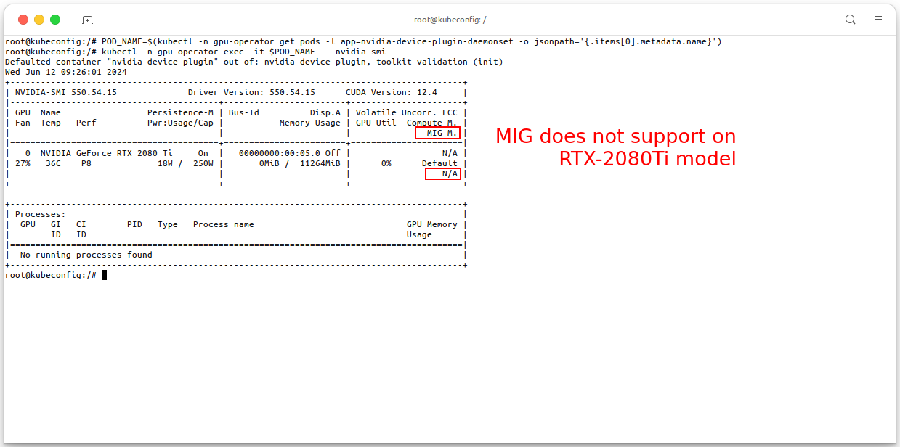
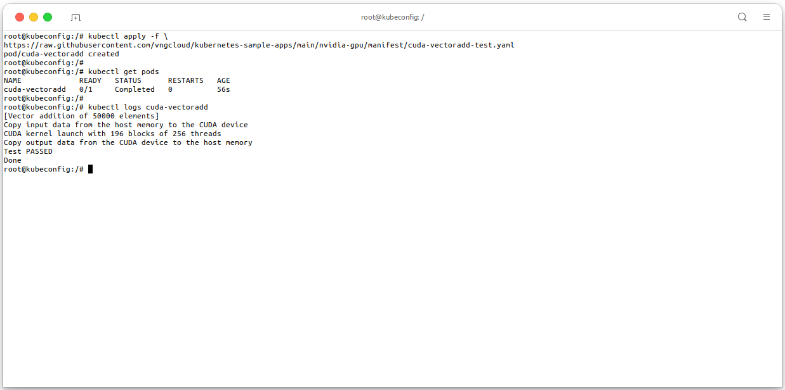
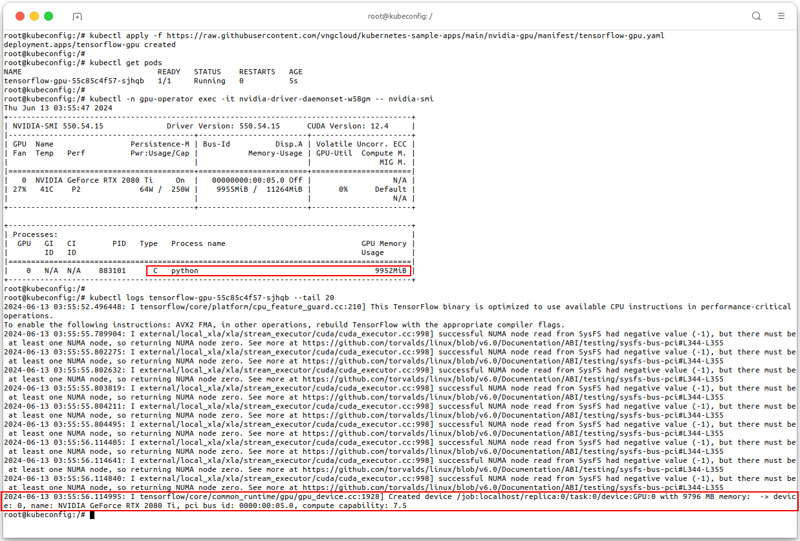

<div style="float: right;"></div><br>

# User Managed

- The **[NVIDIA GPU Operator](https://github.com/NVIDIA/gpu-operator)** is an operator that simplifies the deployment and management of GPU nodes in Kubernetes clusters. It provides a set of Kubernetes custom resources and controllers that work together to automate the management of GPU resources in a Kubernetes cluster.
- In this guide, we will show you how to:
  - Create a nodegroup with NVIDIA GPUs in a VKS cluster.
  - Install the NVIDIA GPU Operator in a VKS cluster.
  - Deploy your GPU workload in a VKS cluster.
  - Configure GPU Sharing in a VKS cluster.
  - Monitor GPU resources in a VKS cluster.
  - Autoscale GPU resources in a VKS cluster.

# Prerequisites

- A VKS cluster with at least **one NVIDIA GPU nodegroup**.
- `kubectl` command-line tool installed on your machine. For more information, see [Install and Set Up kubectl](https://kubernetes.io/docs/tasks/tools/install-kubectl/).
- `helm` command-line tool installed on your machine. For more information, see [Installing Helm](https://helm.sh/docs/intro/install/).
- (Optional) Other tools and libraries that you can use to monitor and manage your Kubernetes resources:

  - `kubectl-view-allocations` plugin for monitoring cluster resources. For more information, see [kubectl-view-allocations](https://github.com/davidB/kubectl-view-allocations).

- The image below shows my machine setup, it will be used in this guide:

  ```bash
  # Check kubectl CLI version
  kubectl version

  # Check Helm version
  helm version

  # Check kubectl-view-allocations version
  kubectl-view-allocations --version
  ```

  <center>

  

  </center>

- And this is my VKS cluster with 1 NVIDIA GPU nodegroup, it will be used in this guide, execute the following command to check the nodegroup in your cluster:

  ```bash
  kubectl get nodes -owide
  ```

  <center>

  

  </center>

# Installing the GPU Operator

- This guide only focus on installing the NVIDIA GPU Operator, for more information about the NVIDIA GPU Operator, see [NVIDIA GPU Operator Documentation](https://docs.nvidia.com/datacenter/cloud-native/gpu-operator/latest/getting-started.html). We manually install the NVIDIA GPU Operator in a VKS cluster by using Helm charts, execute the following command to install the NVIDIA GPU Operator in your VKS cluster:

  ```bash
  helm install nvidia-gpu-operator --wait --version v24.3.0 \
    -n gpu-operator --create-namespace \
    oci://vcr.vngcloud.vn/81-vks-public/vks-helm-charts/gpu-operator \
    --set dcgmExporter.serviceMonitor.enabled=true
  ```

  <center>

  

  </center>

- You **MUST** wait for the installation to complete _(about 5-10 minutes)_, execute the following command to check all the pods in the `gpu-operator` namespace are **running**:

  ```bash
  kubectl -n gpu-operator get pods -owide
  ```

  <center>

  

  </center>

- The operator will label the node with the `nvidia.com/gpu` label, which can be used to filter the nodes that have GPUs. The `nvidia.com/gpu` label is used by the NVIDIA GPU Operator to identify nodes that have GPUs. The NVIDIA GPU Operator will only deploy the NVIDIA GPU device plugin on nodes that have the `nvidia.com/gpu` label.

  ```bash
  NODE_NAME=<put-your-node-name>
  kubectl get node -o json $NODE_NAME | jq '.items[].metadata.labels' | grep "nvidia.com"
  ```

  <center>

  

  </center>

  > - For the above result, the single node in the cluster has the `nvidia.com/gpu` label, which means that the node has GPUs.
  > - These labels also tell that this node is using 1 card of RTX 2080Ti GPU, number of available GPUs, the GPU Memory and other information.

- On the pod `nvidia-device-plugin-daemonset` in the `gpu-operator` namespace, you can execute `nvidia-smi` command to check the GPU information of the node:

  ```bash
  POD_NAME=$(kubectl -n gpu-operator get pods -l app=nvidia-device-plugin-daemonset -o jsonpath='{.items[0].metadata.name}')
  kubectl -n gpu-operator exec -it $POD_NAME -- nvidia-smi
  ```

  <center>
    
    

  </center>

# Deploy your GPU workload

## Cuda VectorAdd Test

- In this section, we will show you how to deploy a GPU workload in a VKS cluster. We will use the `cuda-vectoradd-test` workload as an example. The `cuda-vectoradd-test` workload is a simple CUDA program that adds two vectors together. The program is provided as a container image that you can deploy in your VKS cluster. See file [cuda-vectoradd-test.yaml](https://raw.githubusercontent.com/vngcloud/kubernetes-sample-apps/main/nvidia-gpu/manifest/cuda-vectoradd-test.yaml).

  ```bash
  # Apply the manifest
  kubectl apply -f \
  https://raw.githubusercontent.com/vngcloud/kubernetes-sample-apps/main/nvidia-gpu/manifest/cuda-vectoradd-test.yaml

  # Check the pods
  kubectl get pods

  # Check the logs of the pod
  kubectl logs cuda-vectoradd

  # [Optional] Clean the resources
  kubectl delete deploy cuda-vectoradd
  ```

  <center>

  

  </center>

## TensorFlow Test

- In this section, we apply a `Deployment` manifest for a TensorFlow GPU application. The purpose of this `Deployment` is to create and manage a single pod running a TensorFlow container that utilizes GPU resource for executing the sum of random values from a normal distribution of size \\( 100000 \\) by \\( 100000 \\). For more detail about the manifest, see file [tensorflow-gpu.yaml](https://raw.githubusercontent.com/vngcloud/kubernetes-sample-apps/main/nvidia-gpu/manifest/tensorflow-gpu.yaml)

  ```bash
  # Apply the manifest
  kubectl apply -f \
  https://raw.githubusercontent.com/vngcloud/kubernetes-sample-apps/main/nvidia-gpu/manifest/tensorflow-gpu.yaml

  # Check the pods
  kubectl get pods

  # Check processes are running using nvidia-smi
  kubectl -n gpu-operator exec -it <put-your-nvidia-driver-daemonset-pod-name> -- nvidia-smi

  # Check the logs of the TensorFlow pod
  kubectl logs <put-your-tensorflow-gpu-pod-name> --tail 20

  # [Optional] Clean the resources
  kubectl delete deploy tensorflow-gpu
  ```

  <center>

  

  </center>

# Configure GPU Sharing
- GPU sharing strategies allow multiple containers to efficiently use your attached GPUs and save running costs. The following tables summarizes the difference between the GPU sharing modes supported by NVIDIA GPUs:

  |Sharing mode|Supported by VKS|Workload isolation level|Pros|Cons|Suitable for these workloads|
  |-|:-:|:-:|:-|:-|:-|
  |**Multi-instance GPU (MIG)**|❌|Best| <ul><li>Processes are executed in parallel</li><li>Full isolation (dedicated memory and compute resources)</li></ul>| <ul><li>Supported by fewer GPU models (only Ampere or more recent architectures)</li><li>Coarse-grained control over memory and compute resources</li></ul> |<ul><li>Recommended for workloads running in parallel and that need certain resiliency and QoS. For example, when running AI inference workloads, multi-instance GPU multi-instance GPU allows multiple inference queries to run simultaneously for quick responses, without slowing each other down.</li></ul>|
  |**GPU Time-slicing**|✅|None| <ul><li>Processes are executed concurrently</li><li>Supported by older GPU architectures (Pascal or newer)</li></ul>| <ul><li>No resource limits</li><li>No memory isolation</li><li>Lower performance due to context-switching overhead</li></ul>|<ul><li>Recommended for bursty and interactive workloads that have idle periods. These workloads are not cost-effective with a fully dedicated GPU. By using time-sharing, workloads get quick access to the GPU when they are in active phases.</li><li>GPU time-sharing is optimal for scenarios to avoid idling costly GPUs where full isolation and continuous GPU access might not be necessary, for example, when multiple users test or prototype workloads.</li><li>Workloads that use time-sharing need to tolerate certain performance and latency compromises.</li></ul>|
  |**Multi-process server (MPS)**|✅|Medium| <ul><li>Processes are executed parallel</li><li>Fine-grained control over memory and compute resources allocation</li></ul> | <ul><li>No error isolation and memory protection</li></ul>|<ul><li>Recommended for batch processing for small jobs because MPS maximizes the throughput and concurrent use of a GPU. MPS allows batch jobs to efficiently process in parallel for small to medium sized workloads.</li><li>NVIDIA MPS is optimal for cooperative processes acting as a single application. For example, MPI jobs with inter-MPI rank parallelism. With these jobs, each small CUDA process (typically MPI ranks) can run concurrently on the GPU to fully saturate the whole GPU.</li><li>Workloads that use CUDA MPS need to tolerate the [memory protection and error containment limitations](https://docs.nvidia.com/deploy/mps/#topic_3_3_3).</li></ul>|

## GPU time-slicing
- VKS uses the built-in timesharing ability provided by the NVIDIA GPU and the software stack. Starting with the **[Pascal architecture](https://www.nvidia.com/en-us/data-center/pascal-gpu-architecture/)**, NVIDIA GPUs support instruction level preemption. When doing context switching between processes running on a GPU, instruction-level preemption ensures every process gets a fair timeslice. GPU time-sharing provides software-level isolation between the workloads in terms of address space isolation, performance isolation, and error isolation.


<div style="float: right;">
<i>Cuong. Duong Manh - 2024/06/12</i>
</div>