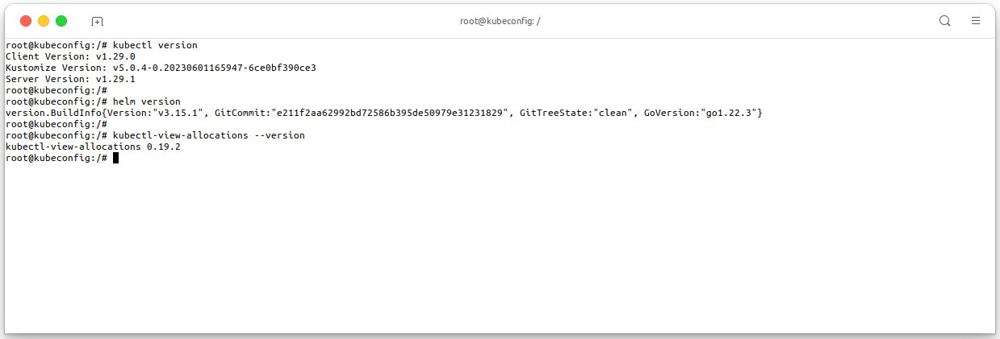
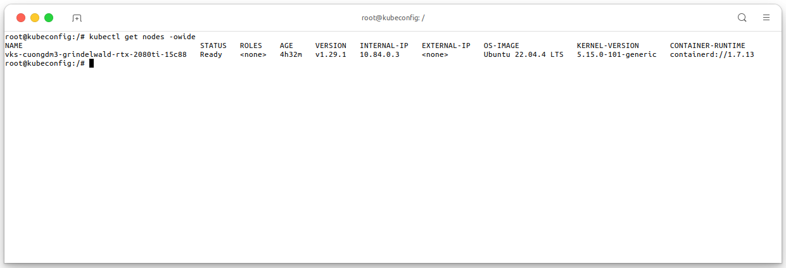
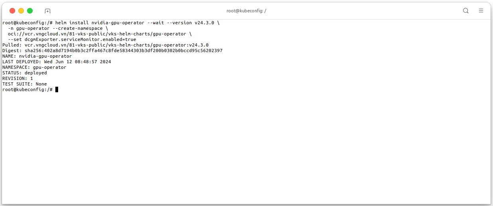
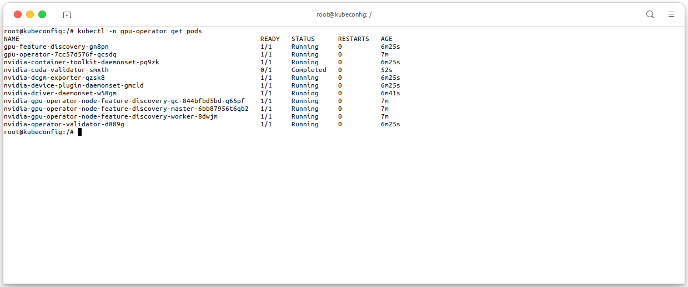
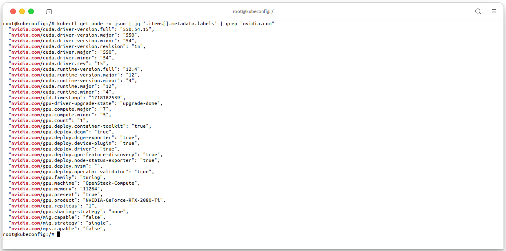

<div style="float: right;"></div><br>


# User Managed
- The **[NVIDIA GPU Operator](https://github.com/NVIDIA/gpu-operator)** is an operator that simplifies the deployment and management of GPU nodes in Kubernetes clusters. It provides a set of Kubernetes custom resources and controllers that work together to automate the management of GPU resources in a Kubernetes cluster.
- In this guide, we will show you how to:
  - Create a nodegroup with NVIDIA GPUs in a VKS cluster.
  - Install the NVIDIA GPU Operator in a VKS cluster.
  - Deploy some GPU workload in a VKS cluster.
  - Configure GPU Sharing in a VKS cluster.
  - Monitor GPU resources in a VKS cluster.
  - Autoscale GPU resources in a VKS cluster.

# Prerequisites
- A VKS cluster with at least **one NVIDIA GPU nodegroup**.
- `kubectl` command-line tool installed on your machine. For more information, see [Install and Set Up kubectl](https://kubernetes.io/docs/tasks/tools/install-kubectl/).
- `helm` command-line tool installed on your machine. For more information, see [Installing Helm](https://helm.sh/docs/intro/install/).
- (Optional) Other tools and libraries that you can use to monitor and manage your Kubernetes resources:
  - `kubectl-view-allocations` plugin for monitoring cluster resources. For more information, see [kubectl-view-allocations](https://github.com/davidB/kubectl-view-allocations).

- The image below shows my machine setup, it will be used in this guide:
  ```bash
  # Check kubectl CLI version
  kubectl version

  # Check Helm version
  helm version
  
  # Check kubectl-view-allocations version
  kubectl view-allocations --version
  ```

<center>

  

</center>

- And this is my VKS cluster with 1 NVIDIA GPU nodegroup, it will be used in this guide, execute the following command to check the nodegroup in your cluster:
  ```bash
  kubectl get nodes -owide
  ```

<center>

  

</center>

# Installing the GPU Operator
- This guide only focus on installing the NVIDIA GPU Operator, for more information about the NVIDIA GPU Operator, see [NVIDIA GPU Operator Documentation](https://docs.nvidia.com/datacenter/cloud-native/gpu-operator/latest/getting-started.html). We manually install the NVIDIA GPU Operator in a VKS cluster by using Helm charts, execute the following command to install the NVIDIA GPU Operator in your VKS cluster:
  ```bash
  helm install nvidia-gpu-operator --wait --version v24.3.0 \
    -n gpu-operator --create-namespace \
    oci://vcr.vngcloud.vn/81-vks-public/vks-helm-charts/gpu-operator \
    --set dcgmExporter.serviceMonitor.enabled=true
  ```

<center>

  

</center>

- You **MUST** wait for the installation to complete _(about 5-10 minutes)_, execute the following command to check all the pods in the `gpu-operator` namespace are **running**:
  ```bash
  kubectl -n gpu-operator get pods -owide
  ```

<center>

  

</center>

- The operator will label the node with the `nvidia.com/gpu` label, which can be used to filter the nodes that have GPUs. The `nvidia.com/gpu` label is used by the NVIDIA GPU Operator to identify nodes that have GPUs. The NVIDIA GPU Operator will only deploy the NVIDIA GPU device plugin on nodes that have the `nvidia.com/gpu` label.
  ```bash
  NODE_NAME=<put-your-node-name>
  kubectl get node -o json $NODE_NAME | jq '.items[].metadata.labels' | grep "nvidia.com"
  ```

<center>

  

</center>

  > - For the above result, the single node in the cluster has the `nvidia.com/gpu` label, which means that the node has GPUs.
  > - These labels also tell that this node is using 1 card of RTX 2080Ti GPU, number of available GPUs, the GPU Memory and other information.

<div style="float: right;">
<i>Cuong. Duong Manh - 2024/06/12</i>
</div>