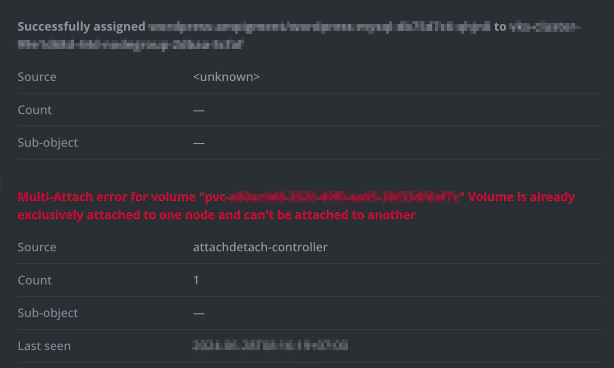
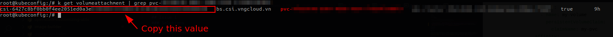

<div style="float: right;"></div><br>

# Troubleshooting

- The table below lists common **issues** and **solutions** for the **VNG Cloud BlockStorage CSI Driver**.

  | #                   | Issue                                                                                                                                                        | Solution                                                                                                        | Notes                                 |
  | ------------------- | ------------------------------------------------------------------------------------------------------------------------------------------------------------ | --------------------------------------------------------------------------------------------------------------- | ------------------------------------- |
  | [Issue 1](#issue-1) | _Multi-Attach error for volume "pvc-xxxxxxxx-xxxx-xxxx-xxxx-xxxxxxxxxxxx" Volume is already exclusive attached to one node and can't be attached to another_ | <ul><li>[sol-csi-01](#sol-csi-01)</li><li>[sol-csi-02](#sol-csi-02)</li><li>[sol-csi-03](#sol-csi-03)</li><li>[sol-csi-04](#sol-csi-04)</li></ul> |  |

# Solutions

## Issue 1

### Reason

- The issue `Multi-Attach error for volume "pvc-xxxxxxxx-xxxx-xxxx-xxxx-xxxxxxxxxxxx" Volume is already exclusive attached to one node and can't be attached to another` in Kubernetes indicates that a **Persistent Volume Claim (PVC)** is trying to be used by **multiple pods** on **different nodes**, but the volume is **already attached** to a specific node and **CANNOT** be attached to another node simultaneously.

### Solutions

#### sol-csi-01

- Ensure Pods Using the Same PVC are Scheduled on the Same Node:
  - You can use `nodeAffinity` or `podAffinity` to ensure that pods using the same `PVC` are scheduled on the same node.
  - Example with `nodeAffinity`:
    ```yaml
    apiVersion: apps/v1
    kind: Deployment
    metadata:
      name: my-app
    spec:
      replicas: 1
      selector:
        matchLabels:
          app: my-app
      template:
        metadata:
          labels:
            app: my-app
        spec:
          containers:
            - name: my-app-container
              image: my-app:latest
              volumeMounts:
                - mountPath: /data
                  name: my-volume
          volumes:
            - name: my-volume
              persistentVolumeClaim:
                claimName: my-pvc
          affinity:
            nodeAffinity:
              requiredDuringSchedulingIgnoredDuringExecution:
                nodeSelectorTerms:
                  - matchExpressions:
                      - key: kubernetes.io/hostname
                        operator: In
                        values:
                          - node1
    ```

#### sol-csi-02

- Delete and recreate the pod using the PVC:
  - As a temporary workaround, if the volume is no longer needed on the old node, you can delete the pod and let Kubernetes reschedule it. Kubernetes will detach the volume from the old node and attach it to the new node.
  - Example:
    ```bash
    kubectl delete pod <pod-name>
    ```

#### sol-csi-03

- Scale down the deployment to 0 replicas and scale it back up:
  - If you have multiple replicas of the same pod, you can scale down the deployment to 0 replicas and scale it back up. This will force Kubernetes to reschedule the pods and attach the volume to the new node. For example:
    ```bash
    kubectl -n <namespace> scale deployment/<deployment_name> \
      --replicas=0
    ```
  - After the scaling down, scale the replica count back to the desired value:
    ```bash
    kubectl -n <namespace> scale deployment/<deployment_name> \
      --replicas=<desired_replica>
    ```

#### sol-csi-04
- Sometime the `VolumeAttachment` resource is not deleted properly, you can delete the `VolumeAttachment` resource manually:
  - Get the `VolumeAttachment` resource:
    ```bash
    kubectl get volumeattachment -A | grep pvc-xxxxxxxx-xxxx-xxxx-xxxx-xxxxxxxxxxxx
    ```
    > 
  - Delete the `VolumeAttachment` resource:
    ```bash
    kubectl delete volumeattachment <volumeattachment-name>
    ```
  
  - Delete the pod that is being stuck:
    ```bash
    kubectl delete pod <pod-name>
    ```